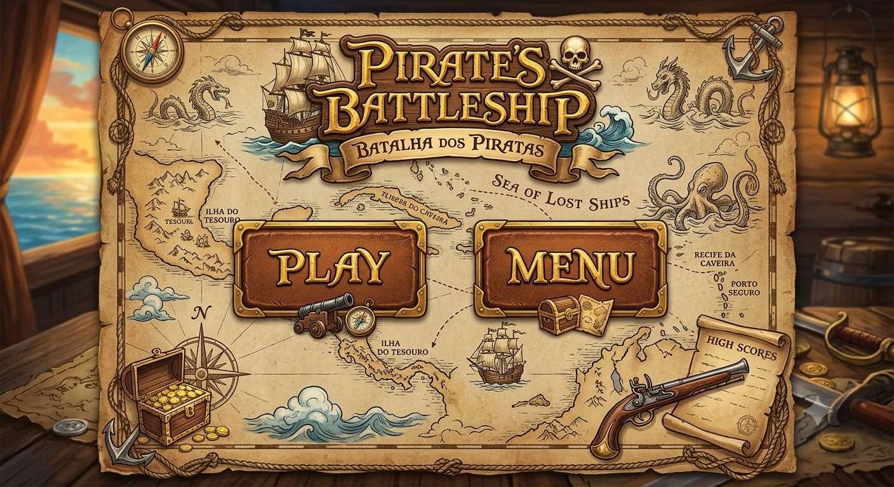

# ⚓ Batalha Naval — Ruby & Gosu

<p align="center">
  
</p>

Projeto desenvolvido para a disciplina de **Paradigmas de Programação**. O
jogo recria uma Batalha Naval entre uma pessoa e o computador, com três mapas,
posicionamento de frota, diferentes modos de turno, armas especiais, níveis de
IA e persistência de pontuações em SQLite.


## 🎮 Fluxo do jogo

```text
Tela inicial
  └─ Play
      └─ Seleção de mapa
          └─ Posicionamento e modo de turno
              └─ Batalha contra a IA
                  ├─ Vitória → nome do vencedor → resultado
                  └─ Derrota → resultado
```

Depois da tela de resultado, o botão Voltar e a tecla `Esc` retornam à seleção
de mapas.

## 🗺️ Mapas e dificuldades

| Mapa | Tabuleiro | Frota | IA | Mísseis | Aviões |
|---|---:|---:|---|---:|---:|
| Poça | 5x5 | 3 navios | Fácil — aleatória | 1 | 1 |
| Lago | 8x8 | 5 navios | Média — caça alvos atingidos | 2 | 1 |
| Oceano | 10x10 | 7 navios | Difícil — busca estratégica | 3 | 1 |

A IA da Poça utiliza apenas o ataque básico. As IAs do Lago e do Oceano podem
usar armas especiais de acordo com sua estratégia e inventário.

## 💥 Armas

| Arma | Comportamento |
|---|---|
| Tiro básico | Ataca uma célula e possui usos ilimitados. |
| Míssil | Ataca uma área 2x2; nas bordas, considera somente células válidas. |
| Avião | Ataca uma linha ou coluna inteira. |

As armas seguem um contrato polimórfico comum. A interface chama o mesmo
`GameController`, independentemente da arma escolhida.

## 🔁 Modos de turno

- **Um tiro por vez:** o turno sempre passa ao adversário depois de um ataque
  válido.
- **Tiro adicional ao acertar:** o atacante continua jogando quando a ação
  acerta ou afunda uma embarcação.

## 🕹️ Controles

| Ação | Controle |
|---|---|
| Navegar e selecionar | Botão esquerdo do mouse |
| Posicionar navio | Clique em uma célula do tabuleiro aliado |
| Alterar orientação no setup | `Espaço` ou botão de orientação |
| Confirmar o nome | `Enter` ou botão Confirmar |
| Voltar | Botão Voltar ou `Esc` |
| Atacar | Clique em uma célula do tabuleiro inimigo |

## 🛠️ Tecnologias

- [Ruby](https://www.ruby-lang.org/)
- [Gosu](https://www.libgosu.org/) `1.4.6`
- [SQLite](https://www.sqlite.org/) por meio da gem `sqlite3` `1.7.3`
- [Minitest](https://github.com/minitest/minitest) `6.0.0`
- Bundler

## 📦 Instalação

### Pré-requisitos

- Ruby instalado e disponível no terminal.
- Bundler instalado.
- No Windows, recomenda-se o RubyInstaller com suporte MSYS2 para as gems
  nativas.

Confira o ambiente:

```powershell
ruby --version
bundle --version
```

Instale o Bundler, se necessário:

```powershell
gem install bundler
```

Na pasta do projeto, instale as dependências:

```powershell
bundle install
```

## ▶️ Executando

Execute o ponto de entrada do projeto:

```powershell
bundle exec ruby main.rb
```

A classe principal aberta pelo executável é `MainWindow`, localizada em
`app/views/main_window.rb`.

## 🧪 Testes

Para executar toda a suíte:

```powershell
bundle exec ruby -Itest -e 'Dir["test/**/*_test.rb"].sort.each { |file| require File.expand_path(file) }'
```

A suíte atual possui **91 testes automatizados**, cobrindo:

- tabuleiros, células, navios e mapas;
- posicionamento manual e automático;
- ataques, armas e inventários;
- turnos, vitória, derrota e duração;
- IAs e níveis de dificuldade;
- pontuação, banco e ranking;
- controllers e integrações de fluxo.

> Os testes de banco exigem que a gem `sqlite3` esteja instalada corretamente.

## 🧱 Arquitetura

O projeto segue uma organização inspirada em MVC:

```text
app/
├── ai/                 # Estratégias da inteligência artificial
├── controllers/        # Navegação, setup e ciclo da partida
├── models/             # Board, Cell, Ship, Player e MapConfig
├── services/           # Pontuação e acesso ao SQLite
├── turn_strategies/    # Modos intercambiáveis de turno
├── views/              # Telas e componentes Gosu
├── weapons/            # Contrato e implementações das armas
└── game.rb             # Estado e regras da partida
```

Princípios utilizados:

- `Board` é a fonte de verdade para células, navios e ataques.
- Strategy define o comportamento dos modos de turno.
- Polimorfismo permite trocar armas pelo mesmo contrato.
- `GameController` entrega eventos estáveis para a interface.
- `MainWindow` cuida somente da janela, navegação e view ativa.
- SQLite concentra jogadores, partidas, pontuações e duração.

## 🧮 Pontuação

A pontuação final considera acertos, embarcações sobreviventes, integridade da
frota e duração:

```text
(acertos × 100)
+ (navios sobreviventes × 500)
+ (células aliadas restantes × 50)
- duração em segundos
```

O resultado mínimo é zero. No ranking, pontuações maiores aparecem primeiro e
o menor tempo é utilizado como critério de desempate.


## 📚 Documentação

- [Requisitos do projeto](docs/Requisitos_do_Projeto.md)
- [Arquitetura e estado técnico](docs/arquitetura_projeto.md)
- [Divisão da equipe](docs/divisao.md)
- [Contrato da lógica de partida](docs/contrato_p2.md)
- [Contrato entre pré e pós-partida](docs/contrato_p3_p4.md)

## 📄 Licença

Este projeto está distribuído sob a licença
[GNU General Public License v3.0](LICENSE).
