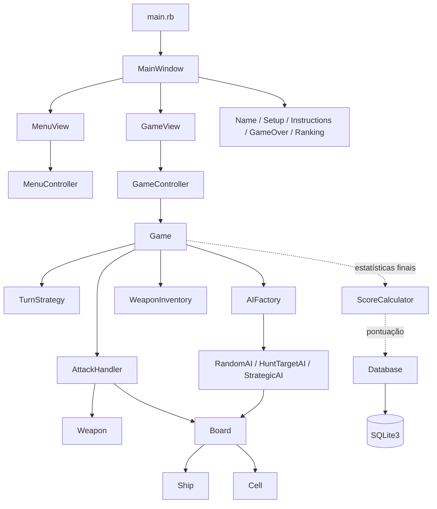

# Batalha Naval - Arquitetura Atualizada do Projeto

> Atualizado em 20 de agosto de 2026 para substituir `arquitetura_projeto.pdf`, que descreve uma divisão de equipe e algumas decisões anteriores ao escopo vigente.

## 1. Fontes de verdade

Em caso de divergência, considere os documentos nesta ordem:

1. [Requisitos do Projeto](./Requisitos_do_Projeto.md): escopo funcional e não funcional vigente.
2. [Divisão Atualizada](./divisao.md): responsabilidades vigentes de P1, P2, P3 e P4.
3. Este documento: arquitetura técnica consolidada.
4. [Contrato de Integração de P2](./contrato_p2.md): detalhes da API do ciclo da partida.

O PDF anterior é apenas uma referência histórica. Sua divisão de pessoas, roadmap, Git Flow e regras divergentes não devem orientar o desenvolvimento atual.

## 2. Objetivo e princípios

O objetivo é entregar um jogo de Batalha Naval funcional, testado e demonstrável usando uma arquitetura simples e adequada ao prazo acadêmico.

Princípios adotados:

- MVC simples, sem ORM, Repository por entidade, Event Bus, DDD ou outras camadas desnecessárias.
- Models e `Game` concentram estado e regras de negócio.
- Views desenham o estado e capturam eventos do Gosu, mas não alteram `Cell`, `Ship` ou `Board` diretamente.
- Controllers convertem ações da interface em operações de domínio.
- `Board` é a fonte de verdade para posicionamento, ataque, acerto, erro e afundamento.
- Armas compartilham um contrato polimórfico.
- Modos de turno usam Strategy.
- O banco usa SQLite3 e SQL puro.
- Arquivos e métodos seguem `snake_case`; classes e módulos seguem `CamelCase`.

### Decisões de simplicidade

- Não existe model ou tabela `Ranking`: o ranking é uma consulta ordenada das partidas.
- Não existem Repository/DAO por entidade: `Database` concentra a pequena API de persistência necessária.
- Não existe entidade `Turn`: o turno é estado do `Game`, enquanto apenas sua política de alternância usa Strategy.
- Não há Observer ou Event Bus: `GameController` devolve eventos imutáveis diretamente para a view.

## 3. Tecnologias

| Tecnologia | Uso |
|---|---|
| Ruby | Linguagem e regras do jogo |
| Gosu | Janela, desenho, mouse, teclado e recursos visuais |
| SQLite3 | Persistência de jogadores, partidas e ranking |
| Minitest | Testes unitários e de integração |
| Bundler | Gerenciamento das dependências do `Gemfile` |

## 4. Estrutura atual de pastas

```text
BattleShip/
├── app/
│   ├── ai/                  # Estratégia do oponente controlado pelo computador
│   ├── controllers/         # Orquestração entre views e regras
│   ├── models/              # Board, Cell, Ship, Player e MapConfig
│   │   └── images/          # Localização atual dos assets gráficos
│   ├── services/            # Database e ScoreCalculator
│   ├── turn_strategies/     # Modos intercambiáveis de turno
│   ├── views/               # MainWindow e telas Gosu
│   ├── weapons/             # Armas, contrato e inventário
│   └── game.rb              # Estado e ciclo completo da partida
├── database/
│   └── schema.sql           # Schema relacional versionado
├── docs/                    # Requisitos, divisão, contratos e arquitetura
├── test/                    # Testes Minitest
├── Gemfile                  # Dependências do projeto
├── Gemfile.lock             # Versões resolvidas das dependências
├── main.rb                  # Ponto de entrada do Gosu
└── README.md                # Instruções finais de instalação e execução
```

### Dívida técnica conhecida dos assets

As imagens estão atualmente em `app/models/images/`, embora não sejam models. A localização arquitetural recomendada é `assets/images/`. Essa mudança pode ser feita depois da integração funcional, atualizando os caminhos usados pelas views. Ela não deve bloquear os requisitos obrigatórios.

## 5. Dependências entre os componentes



As setas tracejadas representam o fluxo de pós-partida conectado pelo
`PostGameController`: ele calcula a pontuação e persiste vitórias identificadas
antes de entregar os dados à `GameOverView`.

## 6. Fluxo MVC

O fluxo esperado de uma ação é:

```text
Clique na View
  -> Controller interpreta a ação
  -> Game aplica turno, inventário e encerramento
  -> AttackHandler expande a arma em coordenadas
  -> Board altera Cell e Ship
  -> Game cria um evento imutável
  -> Controller devolve os eventos
  -> View redesenha o estado
```

Regras de dependência:

- Uma view pode ler o estado do `Game` e dos tabuleiros para desenhá-los.
- Uma view não deve definir diretamente `cell.status`, registrar hits ou remover cargas.
- `AttackHandler` coordena ataques de uma ou várias células, mas não duplica a regra de dano.
- `Game` controla turno, inventário, IA, histórico, duração e vitória/derrota.
- `Database` e `ScoreCalculator` não dependem de Gosu.

## 7. Componentes de domínio

| Classe | Responsabilidade | Estado atual |
|---|---|---|
| `Game` | Dois tabuleiros, turno, IA, inventários, histórico, duração e fim da partida | Implementado e testado |
| `Player` | Nome normalizado e pontuação atual | Model e entrada visual implementados |
| `MapConfig` | Configuração de Poça, Lago e Oceano e criação de tabuleiro/frota | Implementado e testado |
| `Board` | Matriz 2D, posicionamento e resolução de ataques | Implementado e testado |
| `Ship` | Células ocupadas, hits, integridade e afundamento | Implementado e testado |
| `Cell` | Coordenada, navio associado e estado de ataque | Implementado e testado |

### Composição

- Uma partida possui dois `Board`: aliado e inimigo.
- Um `Board` contém várias `Cell` e vários `Ship`.
- Um `Ship` ocupa várias `Cell` do tabuleiro.

## 8. Ataques, armas e inventário

Todas as armas herdam de `Weapon` e implementam:

```ruby
target_cells(row, col, board, **options)
```

Elas calculam coordenadas; somente o `Board` altera o estado das células e dos navios.

| Arma | Identificador | Comportamento |
|---|---|---|
| `BasicShot` | `:basic_shot` | Ataca uma célula e possui uso ilimitado |
| `Missile` | `:missile` | Ataca um bloco 2x2 a partir do canto superior esquerdo |
| `Airplane` | `:airplane` | Ataca uma linha ou coluna inteira |

O `WeaponInventory` mantém cargas independentes para jogador e computador:

| Mapa | Míssil | Avião |
|---|---:|---:|
| Poça | 1 | 1 |
| Lago | 2 | 1 |
| Oceano | 3 | 1 |

Uma carga só é consumida após um ataque válido. A IA fácil preserva o ataque
básico; a média usa armas especiais para explorar acertos visíveis; e a difícil
também as utiliza proativamente nas áreas com maior cobertura ainda disponível.
O contrato completo de prioridade e fallback está em
[`contrato_p2.md`](./contrato_p2.md).

## 9. Turnos e IA

O contrato `TurnStrategy#keep_turn?` permite trocar o comportamento sem espalhar condicionais pelo `Game`.

| Estratégia | Comportamento |
|---|---|
| `SingleShotTurnStrategy` | Sempre alterna o turno depois de uma ação válida |
| `ExtraShotOnHitTurnStrategy` | Mantém o turno se ao menos uma célula resultar em `:hit` ou `:sunk` |

Em armas de área, uma ação concede no máximo uma continuação, mesmo que produza vários acertos.

Quando nenhuma IA é injetada explicitamente, `Game` usa `AIFactory` para selecionar a dificuldade do mapa:

| Mapa | Dificuldade | Estratégia | Comportamento |
|---|---|---|---|
| Poça | Fácil | `RandomAI` | Escolha aleatória e somente tiro básico |
| Lago | Média | `HuntTargetAI` | Persegue acertos e usa especiais apenas com evidência visível |
| Oceano | Difícil | `StrategicAI` | Prolonga acertos, usa busca quadriculada e especiais proativamente |

As três estratégias evitam coordenadas repetidas e consultam apenas informações já visíveis no tabuleiro. Nenhuma usa `cell.ship` ou `cell.occupied?` para descobrir posições ocultas. O `GameController` continua executando ações automáticas enquanto o turno pertencer ao computador ou até a partida terminar.

## 10. Controllers

| Controller | Responsabilidade |
|---|---|
| `AttackHandler` | Validar a origem, obter os alvos da arma e delegar cada coordenada ao `Board` |
| `GameController` | Receber a ação humana e devolver eventos do jogador e da IA |
| `MenuController` | Traduzir ações do menu em navegação da `MainWindow` |

`GameController#handle_player_attack` devolve uma lista congelada de `Game::AttackEvent`. Cada evento contém ator, arma, cargas restantes, células atingidas, turnos anterior e seguinte, estado final e vencedor.

## 11. Views e navegação

| View | Responsabilidade | Estado atual |
|---|---|---|
| `MainWindow` | Manter a view ativa e delegar `draw`, `update` e `button_down` | Implementada |
| `MenuView` | Capa, início, ranking, sair e seleção dos três mapas | Implementada, exceto botão visual de instruções |
| `GameView` | Desenhar tabuleiros, atacar e emitir encerramento | Implementada parcialmente; armas especiais ainda precisam de controles |
| `PlaceholderView` | Substituição temporária para rotas ainda não concluídas | Implementada como apoio temporário |
| `NameView` | Capturar e validar o nome do vencedor após a partida | Implementada |
| `SetupView` | Selecionar modo de turno e realizar posicionamento manual/automático | Implementada |
| `InstructionsView` | Exibir as regras e controles | Pendente |
| `GameOverView` | Exibir resultado, pontuação, duração e situação da persistência | Implementada e integrada ao pós-jogo |
| `RankingView` | Fundo, retorno e contexto opcional do mapa | Shell de P3 implementado; consulta/listagem pendente com P4 |

### Fluxo atualmente executável na interface

```text
Capa -> seleção de mapa -> Setup manual/automático -> GameView
     -> vitória: NameView -> GameOverView -> seleção de mapa
     -> derrota: GameOverView -> seleção de mapa
```

O setup permite escolher as duas estratégias de turno. A frota humana pode ser posicionada por clique ou automaticamente; a frota inimiga é sempre automática.

### Limitações atuais da interface

- O botão visual de Instruções ainda não possui asset nem é desenhado na capa.
- Não existem controles de arma ou orientação do avião.
- A pontuação e a persistência da vitória estão integradas; a listagem do ranking ainda está pendente.

## 12. Setup da partida

O fluxo final deve ser:

1. P3 coleta mapa e modo de turno.
2. P3 permite posicionamento manual por clique, obrigatório no escopo, e oferece posicionamento automático como opção.
3. `MapConfig` cria dois tabuleiros e duas frotas independentes.
4. `TurnStrategyFactory` cria a estratégia selecionada.
5. `Game` recebe tabuleiros, mapa e estratégia.
6. `GameController` é criado e entregue à `GameView`.

O nome não faz parte do setup: conforme a decisão do grupo, ele é solicitado ao vencedor humano somente depois do encerramento, em estilo fliperama.

Exemplo de criação:

```ruby
turn_strategy = TurnStrategyFactory.build(:extra_shot_on_hit)

game = Game.new(
  player_board: player_board,
  enemy_board: enemy_board,
  map_type: map_config.map_type,
  turn_strategy: turn_strategy
)

controller = GameController.new(game)
```

## 13. Encerramento, pontuação e persistência

Quando uma frota é totalmente destruída, `Game` muda para `:victory` ou `:defeat`, congela a duração e disponibiliza estatísticas compatíveis com o calculador.

```ruby
score = ScoreCalculator.calculate(**game.final_statistics)

database.save_match(
  player_name: player.name,
  map_type: game.map_type,
  result: game.result,
  score: score,
  duration_seconds: game.duration_seconds
)
```

A fórmula vigente é:

```text
pontuação =
  (acertos * 100) +
  (navios aliados sobreviventes * 500) +
  (células aliadas restantes * 50) -
  duração em segundos
```

A pontuação mínima é zero.

## 14. Banco de dados

O projeto usa SQLite3 sem ORM. O schema é inicializado automaticamente por `Database`.

```sql
CREATE TABLE IF NOT EXISTS players (
  id INTEGER PRIMARY KEY AUTOINCREMENT,
  name TEXT NOT NULL COLLATE NOCASE UNIQUE,
  CHECK (length(trim(name)) > 0)
);

CREATE TABLE IF NOT EXISTS matches (
  id INTEGER PRIMARY KEY AUTOINCREMENT,
  player_id INTEGER NOT NULL,
  map_type TEXT NOT NULL,
  result TEXT NOT NULL,
  score INTEGER NOT NULL,
  duration_seconds INTEGER NOT NULL,
  played_at TEXT NOT NULL DEFAULT CURRENT_TIMESTAMP,
  FOREIGN KEY (player_id) REFERENCES players(id) ON DELETE CASCADE,
  CHECK (map_type IN ('poca', 'lago', 'oceano')),
  CHECK (result IN ('vitoria', 'derrota')),
  CHECK (score >= 0),
  CHECK (duration_seconds >= 0)
);

CREATE INDEX IF NOT EXISTS index_matches_on_ranking
  ON matches (map_type, score DESC, duration_seconds ASC, played_at ASC);
```

Não existe tabela própria de ranking. O ranking é derivado de `matches`, evitando duplicação de dados.

```sql
SELECT players.name, matches.score, matches.duration_seconds
FROM matches
INNER JOIN players ON players.id = matches.player_id
WHERE matches.map_type = ?
ORDER BY
  matches.score DESC,
  matches.duration_seconds ASC,
  matches.played_at ASC,
  matches.id ASC
LIMIT ?;
```

Cada mapa possui seu próprio ranking. Maior pontuação vem primeiro; em empate, menor duração vem primeiro.

## 15. Divisão vigente da equipe

A descrição detalhada permanece em [divisao.md](./divisao.md).

| Frente | Responsabilidade principal | Situação técnica atual |
|---|---|---|
| P1 - Allan | Models, mapas, posicionamento, pontuação, banco e bootstrap | Componentes próprios concluídos e testados |
| P2 | `Game`, regras, turnos, IA, armas e controllers de partida | Núcleo lógico concluído e testado |
| P3 | Menu, nome, mapa, setup, posicionamento por clique e navegação | Fluxo principal e contrato com P4 implementados; Instruções pendente |
| P4 | Partida visual, pós-partida, ranking e integração final | Pós-jogo e persistência integrados; armas especiais e ranking pendentes |

### Contratos entre as frentes

#### Ataque

1. P4 captura clique, arma e orientação.
2. P4 chama `GameController` de P2.
3. `Game` aplica inventário e turno.
4. `AttackHandler` calcula e delega os alvos ao `Board` de P1.
5. P2 devolve eventos imutáveis para P4 desenhar.

#### Encerramento

1. P2 detecta vitória ou derrota e fornece `final_statistics`.
2. P1 calcula a pontuação e persiste jogador, partida e duração.
3. P4 exibe resultado e ranking.

#### Setup

1. P3 coleta mapa, estratégia e posicionamento.
2. P1 fornece `MapConfig`, `Board`, `Ship` e `Cell`.
3. `SetupController` monta `Game`/`GameController` com os componentes de P1 e P2.
4. P3 navega para a `GameView` de P4.
5. Após uma vitória, P3 coleta o nome e entrega `Player` e `Game` para a tela final de P4.

## 16. Testes e qualidade

Em 20 de agosto de 2026, a suíte automatizada possui:

- 94 testes;
- 422 asserções;
- nenhuma falha, erro ou teste ignorado;
- execução aprovada com warnings do Ruby habilitados.

A cobertura automatizada inclui:

- tabuleiro, mapas, navios, células e posicionamento;
- armas, áreas, repetição e afundamento;
- inventários e limites por mapa;
- IA sem repetição;
- três dificuldades de IA, perseguição de acertos, busca direcional, busca
  quadriculada e política de armas especiais;
- compatibilidade estrita entre `Game`, mapa, tamanho de tabuleiro e frota;
- dois modos de turno;
- vitória, derrota, duração, histórico e estatísticas finais;
- controller de partida;
- cálculo de pontuação;
- persistência, reabertura e ranking por mapa;
- integração do pós-jogo com cálculo de pontuação e persistência de vitórias;
- integração lógica de todos os mapas e modos de turno.

Testes manuais de interface ainda são necessários, pois a suíte atual não substitui a validação visual do Gosu.

## 17. Roadmap restante

Ordem recomendada para concluir o escopo obrigatório:

1. Adicionar a arte e o botão visual de Instruções ao menu.
2. Exibir claramente o turno atual na `GameView`.
3. Adicionar seleção de armas e opções direcionais.
4. Completar `RankingView` com consulta e filtro por mapa.
5. Criar `InstructionsView`.
6. Completar README e realizar testes manuais nos três mapas.
7. Ensaiar o fluxo Menu -> Setup -> Jogo -> Nome do vencedor -> Resultado -> Ranking.

Somente depois devem ser considerados sons, tremor de tela, histórico lateral, animações e reorganização dos assets.

## 18. Fluxo Git adotado

O repositório utiliza atualmente a branch `main`. Para reduzir conflitos:

- sincronizar antes de começar uma tarefa;
- usar commits pequenos e temáticos;
- adicionar arquivos explicitamente, evitando `git add .`;
- não versionar `.idea`, bancos SQLite locais ou arquivos em `text/`;
- não alterar contratos compartilhados sem avisar as frentes consumidoras;
- executar a suíte completa antes do push.

Branches de feature e pull requests podem ser usados pelo grupo, mas não são uma exigência arquitetural do projeto.

## 19. Decisões que substituem o PDF antigo

- A divisão vigente é P1 models/banco, P2 lógica, P3 pré-partida e P4 partida/pós-partida.
- A entrada oficial ocorre por clique na interface, não por digitação de linha e coluna.
- A derrota ocorre quando todos os navios aliados são afundados, não por esgotamento de tentativas.
- O schema possui `duration_seconds` para desempatar o ranking.
- A pontuação usa acertos, sobreviventes, integridade e duração.
- Modos de turno usam Strategy própria; armas usam polimorfismo por `Weapon`.
- O projeto usa `app/services/` no lugar do antigo `utils/`.
- O roadmap antigo de cinco semanas foi substituído pelo estado real e pelo roadmap restante deste documento.

## 20. Critério de pronto

O projeto só deve ser considerado concluído quando:

- `bundle check` confirmar todas as dependências;
- todos os arquivos Ruby tiverem sintaxe válida;
- a suíte automatizada passar;
- `bundle exec ruby main.rb` abrir o menu completo;
- nome, mapa, modo de turno e posicionamento forem configuráveis;
- uma partida puder terminar em vitória e derrota;
- Poça, Lago e Oceano utilizarem respectivamente as IAs fácil, média e difícil;
- ataque básico, míssil e avião funcionarem pela interface;
- os dois modos de turno funcionarem pela interface;
- resultado, pontuação e duração forem exibidos;
- jogador e partida forem persistidos;
- ranking for filtrado por mapa e desempatar por duração;
- Poça, Lago e Oceano passarem por teste manual;
- README permitir instalação e execução por outra pessoa;
- não houver arquivos obrigatórios ignorados nem artefatos locais versionados.
